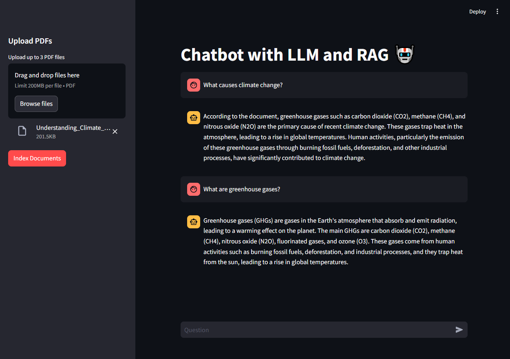

# Chatbot with LLM and RAG
This is an experimental project that utilizes a local Large Language Model ([Llama 3.2](https://ollama.com/library/llama3.2) in this case) to perform Retrieval-Augmented Generation (RAG), enabling it to answer questions based on information extracted from sample PDFs. For embeddings, we are using the [nomic-embed-text](https://ollama.com/library/nomic-embed-text) model along with the [Chroma](https://docs.trychroma.com/) VectorStore.

Additionally, a web-based UI has been developed using [Streamlit](https://streamlit.io/) to offer an alternative and user-friendly interface for interacting with the chatbot.

    

## Setup
1. Clone the repository to your local machine.
2. Install [Ollama](https://ollama.com/download) and pull the required models:  
    `ollama pull llama3.2:1b`  
    `ollama pull nomic-embed-text`

3. Activate the virtual environment.
4. Set up the [Tavily](https://app.tavily.com/home) API key.  
    `TAVILY_API_KEY='<your-api-key>'`
5. Install dependencies:  
    `pip install -r requirements.txt`

## Running the Project
1. Ensure the virtual environment is activated.
2. Launch the Streamlit web UI for the chatbot:  
    `streamlit run src/ui.py`

## References
https://python.langchain.com/docs/tutorials/chatbot/
